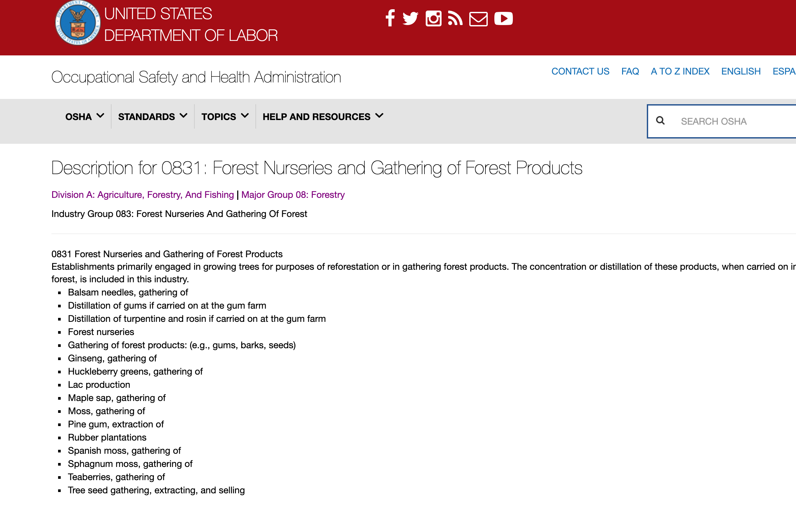

# The OSHA SIC (Standard Industrial Classification) Code Manual, compiled as CSV


> *tl;dr, Download the SIC code manual as CSV:* [compiled/sic_manual.csv](https://raw.githubusercontent.com/storydrivendatasets/osha-sic-code-manual-scraper/master/data/compiled/sic_manual.csv)


## Intro

If you're working with OSHA data – such as the [OSHA enforcement data catalog](https://enforcedata.dol.gov/views/data_catalogs.php) you might have come across SIC codes. Apparently, the [SIC codes haven't been updated since 1987](https://www.naics.com/what-is-the-difference-between-naics-codes-and-sic-codes/) and are meant to be replaced by the NAICS system, which may explain why there's no easy-to-find official SIC code book in a structured format.


## Get the data

So I wrote a scraper for what appears to be an official web directory of SIC codes, maintained by OSHA:

https://www.osha.gov/pls/imis/sic_manual.html

The scripts that scrape and compile the data can be found at [scripts], but if you just want the SIC codes as a packaged CSV file, here you go:

**Get the compiled data** [compiled/sic_manual.csv](https://raw.githubusercontent.com/storydrivendatasets/osha-sic-code-manual-scraper/master/data/compiled/sic_manual.csv)

### Notes about the data

Each row correspond to an individual SICs code, and each code has an individual page on the OSHA SICS manual site.

For example, code `0831`, which corresponds to "Forest Nurseries and Gathering of Forest Products", can be found on the OSHA site here:

[https://www.osha.gov/pls/imis/sic_manual.display?id=367&tab=description](https://www.osha.gov/pls/imis/sic_manual.display?id=367&tab=description )

That page looks like:

<a href="https://www.osha.gov/pls/imis/sic_manual.display?id=367&tab=description 
">
</a>


Every field in the CSV corresponds to something on the page.

In particular, the `sic_examples` field contains *every* list item found on the corresponding code page. Each example is delimited by a newline character, so the spreadsheet looks a bit goofy like this:


## Running the scrape yourself

There's a [Makefile](Makefile) to make re-running the scrape convenient. The following task: 

```sh
$ make ALL
```

&ndash; will erase everything in [data/collected](data/collected) and [data/compiled](data/compiled) and refetch all the pages from the online OSHA manual, and then rescrape them to extract the data.

This requires **Python 3.x** and the libraries found in [requirements.txt](requirements.txt)


## More reading

- University of Pittsburgh guide to SIC and NAICS Codes: https://www.library.pitt.edu/sic-and-naics-codes
- NAICS Association: What Exactly Are NAICS & SIC Codes?
 https://www.naics.com/what-is-the-difference-between-naics-codes-and-sic-codes/
- NAICS Association: SIC directory https://www.naics.com/business-lists/counts-by-sic-code/
- NAICS Association: SIC to NAICS crosswalk: https://www.naics.com/sic-naics-crosswalk-search-results
